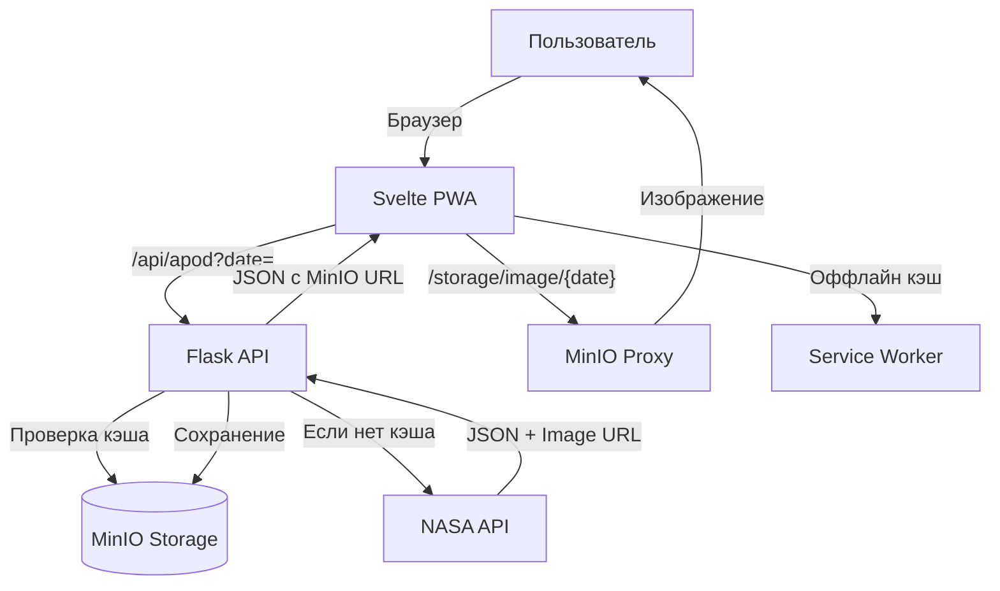

# План создания NASA APOD PWA (Поэтапная разработка)

## Архитектура



## Структура проекта

```
StarTrack/
├── backend/
│   ├── app/
│   │   ├── __init__.py
│   │   ├── routes.py
│   │   ├── apod_service.py
│   │   └── storage/
│   │       ├── minio_client.py
│   │       └── minio_proxy.py
│   ├── requirements.txt
│   └── Dockerfile
├── frontend/
│   ├── src/
│   │   ├── App.svelte
│   │   ├── main.ts
│   │   ├── lib/
│   │   │   ├── components/
│   │   │   ├── services/api.ts
│   │   │   ├── stores/apod.ts
│   │   │   └── types/apod.ts
│   │   └── app.css
│   ├── public/
│   │   ├── manifest.json
│   │   └── sw.js
│   ├── package.json
│   ├── vite.config.ts
│   └── Dockerfile
├── docker-compose.yml
├── .env.example
└── README.md
```

## Этап 1: Настройка окружения и инфраструктуры

**Цель:** Подготовить Docker окружение с MinIO и базовыми конфигурациями

### 1.1 Docker Compose с MinIO

Файл: [`docker-compose.yml`](docker-compose.yml)

- **minio** сервис: порты 9000 (API), 9001 (Console)
  - Volume для данных: `./minio_data:/data`
  - Environment: `MINIO_ROOT_USER`, `MINIO_ROOT_PASSWORD`
  - Healthcheck для проверки готовности
- **backend** сервис: порт 5000, зависит от minio
  - Environment: NASA API ключ, MinIO credentials
- **frontend** сервис: порт 3000
  - Nginx proxy: `/api/*` → backend:5000, `/storage/*` → backend:5000

### 1.2 Environment конфигурация

Файл: [`.env.example`](.env.example)

```env
NASA_API_KEY=DEMO_KEY
MINIO_ENDPOINT=minio:9000
MINIO_ACCESS_KEY=minioadmin
MINIO_SECRET_KEY=minioadmin
MINIO_BUCKET=apod-cache
```

### 1.3 Backend зависимости

Файл: [`backend/requirements.txt`](backend/requirements.txt)

```
Flask==3.0.0
flask-cors==4.0.0
requests==2.31.0
minio==7.2.0
python-dotenv==1.0.0
gunicorn==21.2.0
```

### 1.4 Frontend инициализация

Файлы: [`frontend/package.json`](frontend/package.json), [`frontend/vite.config.ts`](frontend/vite.config.ts), [`frontend/tsconfig.json`](frontend/tsconfig.json)

- Svelte 4 + TypeScript + Vite
- Зависимости: svelte, vite, typescript, @sveltejs/vite-plugin-svelte

**Результат этапа:** `docker-compose up` запускает все три сервиса (MinIO готов к работе)

---

## Этап 2: MVP - Минимальная работающая версия

**Цель:** Базовое приложение без кэша - просто показывает изображение NASA за сегодня

### 2.1 Flask API (без MinIO)

Файлы: [`backend/app/__init__.py`](backend/app/__init__.py), [`backend/app/routes.py`](backend/app/routes.py)

- Инициализация Flask с CORS
- Endpoint `/api/apod`:
  - Принимает query параметр `date` (опционально, по умолчанию сегодня)
  - Валидация даты (формат YYYY-MM-DD, диапазон: сегодня-30 дней до сегодня)
  - Возвращает ошибку 400 при невалидной дате

### 2.2 NASA Service (прямой запрос)

Файл: [`backend/app/apod_service.py`](backend/app/apod_service.py)

- Функция `fetch_apod_from_nasa(date: str)`:
  - Запрос к `https://api.nasa.gov/planetary/apod?api_key=...&date=...`
  - Парсинг JSON: `url`, `hdurl`, `title`, `explanation`, `date`, `media_type`
  - Обработка ошибок сети
  - **На этом этапе:** возвращает оригинальные URL от NASA (без кэша)

### 2.3 Frontend базовая структура

**TypeScript типы** ([`frontend/src/lib/types/apod.ts`](frontend/src/lib/types/apod.ts)):

```typescript
export interface ApodData {
  date: string;
  title: string;
  explanation: string;
  url: string;
  hdurl?: string;
  media_type: string;
}
```

**API Service** ([`frontend/src/lib/services/api.ts`](frontend/src/lib/services/api.ts)):

```typescript
export async function fetchApod(date?: string): Promise<ApodData>
```

**Svelte Store** ([`frontend/src/lib/stores/apod.ts`](frontend/src/lib/stores/apod.ts)):

- `apodData`, `isLoading`, `error`

### 2.4 Простой UI

**App.svelte** ([`frontend/src/App.svelte`](frontend/src/App.svelte)):

- `onMount`: загрузка изображения за сегодня
- Отображение изображения, заголовка, описания
- Индикатор загрузки
- Обработка ошибок

**Результат этапа:** Приложение показывает APOD за сегодня (изображение грузится напрямую с NASA)

---

## Этап 3: Кэширование в MinIO

**Цель:** Сохранять изображения и метаданные в MinIO для быстрой повторной загрузки

### 3.1 MinIO Client (backend операции)

Файл: [`backend/app/storage/minio_client.py`](backend/app/storage/minio_client.py)

- Инициализация клиента MinIO
- Создание bucket `apod-cache` при старте
- Функции:
  - `check_cached_data(date)` - проверка наличия `{date}/metadata.json`
  - `get_cached_json(date)` - получение JSON из MinIO
  - `save_json(date, json_data)` - сохранение метаданных
  - `download_and_save_image(date, image_url, hd=False)` - скачивание изображения
    - Сохраняет: `{date}/image.jpg` и `{date}/image_hd.jpg`

Структура MinIO:

```
apod-cache/
  2025-12-16/
    metadata.json
    image.jpg
    image_hd.jpg
```

### 3.2 MinIO Proxy (доступ к файлам)

Файл: [`backend/app/storage/minio_proxy.py`](backend/app/storage/minio_proxy.py)

- Endpoint `/storage/image/<date>` - обычное изображение (presigned URL или proxy)
- Endpoint `/storage/image/<date>/hd` - HD изображение
- Валидация даты и прав доступа

### 3.3 Интеграция кэша в NASA Service

Обновление [`backend/app/apod_service.py`](backend/app/apod_service.py):

Логика:

1. Проверить кэш MinIO (`check_cached_data`)
2. Если есть → вернуть с URL `/storage/image/{date}`
3. Если нет → запросить NASA API → сохранить в MinIO → вернуть

**Результат этапа:** Повторные запросы грузятся из MinIO, а не от NASA

---

## Этап 4: Навигация по датам

**Цель:** Кнопки для перехода на предыдущий/следующий день

### 4.1 Обновление Store

Файл: [`frontend/src/lib/stores/apod.ts`](frontend/src/lib/stores/apod.ts)

- Добавить `currentDate` (writable store)
- Вычисляемые stores:
  - `canGoPrev` (дата > сегодня-30 дней)
  - `canGoNext` (дата < сегодня)

### 4.2 Navigation компонент

Файл: [`frontend/src/lib/components/Navigation.svelte`](frontend/src/lib/components/Navigation.svelte)

- Props: `currentDate`, `canGoPrev`, `canGoNext`
- Кнопки "← Предыдущий" и "Следующий →"
- Автоматическая деактивация на границах
- События: `on:prev`, `on:next`

### 4.3 Обновление App.svelte

- Обработчики `goToPrevDay()`, `goToNextDay()`
- Реактивность: при изменении `$currentDate` → автозагрузка нового изображения
- Блокировка кнопок при `$isLoading`

**Результат этапа:** Навигация по датам (последние 30 дней)

---

## Этап 5: PWA функциональность

**Цель:** Оффлайн режим и установка как приложение

### 5.1 Web App Manifest

Файл: [`frontend/public/manifest.json`](frontend/public/manifest.json)

```json
{
  "name": "NASA APOD Viewer",
  "short_name": "NASA APOD",
  "display": "standalone",
  "start_url": "/",
  "theme_color": "#000000",
  "background_color": "#ffffff",
  "icons": [
    {"src": "/icons/icon-192.png", "sizes": "192x192", "type": "image/png"},
    {"src": "/icons/icon-512.png", "sizes": "512x512", "type": "image/png"}
  ]
}
```

### 5.2 Service Worker

Файл: [`frontend/public/sw.js`](frontend/public/sw.js)

- Кэширование статических файлов (JS, CSS, HTML)
- Стратегия "Network First" для `/api/apod`
- Кэширование изображений из `/storage/image/`
- Оффлайн fallback

### 5.3 Регистрация SW

Обновление [`frontend/src/main.ts`](frontend/src/main.ts):

```typescript
if ('serviceWorker' in navigator) {
  navigator.serviceWorker.register('/sw.js');
}
```

Обновление [`frontend/index.html`](frontend/index.html): meta теги для PWA

**Результат этапа:** Приложение работает оффлайн, можно установить на домашний экран

---

## Этап 6: UI улучшения и скачивание HD

### 6.1 ImageViewer компонент

Файл: [`frontend/src/lib/components/ImageViewer.svelte`](frontend/src/lib/components/ImageViewer.svelte)

- Props: `imageUrl`, `hdUrl`, `title`, `explanation`, `date`
- Lazy loading для изображений
- Кнопка "Скачать HD" (если `hdurl` доступен)
- Функция скачивания: генерация имени `NASA_APOD_{date}_{sanitized-title}.jpg`

### 6.2 Loader компонент

Файл: [`frontend/src/lib/components/Loader.svelte`](frontend/src/lib/components/Loader.svelte)

- Красивая анимация загрузки (CSS animation)

### 6.3 Адаптивные стили

Файл: [`frontend/src/app.css`](frontend/src/app.css)

- Mobile-first дизайн
- CSS Grid/Flexbox
- Темная тема (опционально)

**Результат этапа:** Полностью функциональное приложение с красивым UI

---

## Этап 7: Автоматическое тестирование через MCP

**Цель:** Автоматизированная проверка всех функций приложения

### 7.1 План тестирования

**Backend тесты:**

1. MinIO подключение и создание bucket
2. `/api/apod` без параметров (возвращает сегодня)
3. `/api/apod?date=2025-12-15` (валидная дата)
4. `/api/apod?date=invalid` (ошибка 400)
5. `/api/apod?date=2020-01-01` (дата вне диапазона → ошибка 400)
6. Проверка кэширования: запрос дважды → второй раз из MinIO
7. `/storage/image/<date>` возвращает изображение
8. `/storage/image/<date>/hd` возвращает HD изображение

**Frontend тесты:**

1. Приложение открывается, показывает изображение за сегодня
2. Кнопка "Следующий день" неактивна (текущая дата)
3. Нажатие "Предыдущий день" → загружает вчерашнее изображение
4. Переход на 30 дней назад → кнопка "Предыдущий" деактивируется
5. Возврат к сегодня → кнопка "Следующий" деактивируется
6. Скачивание HD изображения (проверка имени файла)

**PWA тесты:**

1. Service Worker регистрируется
2. Manifest.json доступен
3. Оффлайн режим: отключить сеть → приложение работает с кэшем

### 7.2 Автоматизация через MCP

Использовать MCP для:

- Запуск Docker Compose
- Проверка healthcheck контейнеров
- cURL запросы к API endpoints
- Проверка HTTP статусов и JSON структуры
- Инспекция MinIO (проверка наличия файлов в bucket)
- Headless браузер (playwright/puppeteer) для frontend тестов

**Результат этапа:** Полное покрытие тестами, уверенность в работоспособности

---

## Этап 8: Документация

Файл: [`README.md`](README.md)

- Описание проекта
- Получение NASA API ключа
- Инструкции запуска: `docker-compose up --build`
- Доступ к сервисам:
  - Frontend: http://localhost:3000
  - Backend API: http://localhost:5000
  - MinIO Console: http://localhost:9001
- Архитектура и технологии
- Примеры API запросов

**Результат:** Готовое к деплою приложение с полной документацией

---

## Ключевые технологии

- **Backend:** Flask + Gunicorn + Flask-CORS
- **Storage:** MinIO (S3-compatible)
- **Frontend:** Svelte 4 + TypeScript + Vite
- **State:** Svelte Stores
- **PWA:** Service Worker + Manifest
- **Container:** Docker + Docker Compose
- **Testing:** MCP + cURL + Playwright